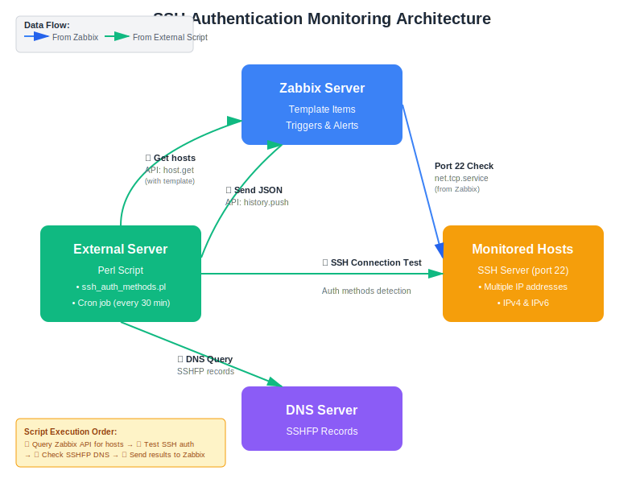

# SSH Authentication Methods Monitoring for Zabbix

Zabbix template for monitoring SSH service availability and authentication methods. The template performs two types of tests:
- SSH port availability check from Zabbix server/proxy
- External authentication methods check that verifies which authentication methods are publicly accessible

## Features

- **SSH Availability Monitoring**: Checks if SSH port is accessible
- **Authentication Methods Detection**: Identifies available authentication methods (password, publickey, etc.)
- **SSHFP DNS Validation**: Verifies SSH fingerprints against DNS SSHFP records
- **Security Alerts**:
  - HIGH: SSH unavailable, password authentication enabled, SSHFP mismatch
  - WARNING: Non-publickey authentication methods detected
  - INFO/AVERAGE: No data received from external script

## Architecture

The monitoring consists of two components:

1. **Zabbix Template**: Defines items, triggers, and macros
2. **External Script**: Runs on a separate server to test SSH authentication methods from outside perspective



## Installation

### 1. Import Zabbix Template

1. In Zabbix web interface, go to **Configuration** → **Templates**
2. Click **Import**
3. Select `SSH Authentication Methods.yaml`
4. Import the template

### 2. Create Zabbix API User

Create a dedicated user with minimal permissions for the external script:

1. Go to **Administration** → **Users**
2. Click **Create user**
3. Configure user:
   - **Alias**: `ssh-monitor-api` (or your preferred name)
   - **Groups**: Create a new group "API Users" with **Read** permission to hosts
   - **Password**: Set a strong password
4. Go to **Administration** → **User roles**
5. Create a new role "API Monitoring" with permissions:
   - **User type**: User
   - **Access to UI elements**: Disable all
   - **Access to services**: None
   - **Access to modules**: None
   - **Access to API**: Enable
   - **API methods**: Allow only:
     - `host.get`
     - `hostinterface.get`
     - `item.get`
6. Assign this role to the `ssh-monitor-api` user

### 3. Generate API Token

1. Go to **Administration** → **Users**
2. Open the `ssh-monitor-api` user
3. Go to **API tokens** tab
4. Click **Create API token**
5. Set expiration date (or leave empty for no expiration)
6. Save and **copy the generated token** (you won't be able to see it again)

### 4. Install External Script

#### Prerequisites

Install required Perl modules on the external monitoring server:

```bash
# Debian/Ubuntu
sudo apt-get install libnet-ssh-perl libjson-perl libwww-perl libnet-dns-perl

# RHEL/CentOS/Rocky
sudo yum install perl-Net-SSH-Perl perl-JSON perl-LWP-Protocol-https perl-Net-DNS

# Or via CPAN
cpan Net::SSH::Perl JSON LWP::UserAgent Net::DNS
```

#### Script Installation

1. Copy script files to monitoring server:

```bash
sudo mkdir -p /opt/zabbix-ssh-monitor
sudo cp script/* /opt/zabbix-ssh-monitor/
sudo chmod +x /opt/zabbix-ssh-monitor/*.pl
```

2. Create configuration file `/opt/zabbix-ssh-monitor/conf/ssh.auth_methods.yaml`:

```yaml
# kam se loguje z aplikace
# možnosti:
#   syslog
#   jméno_souboru
log:
    destination: logs/ssh.auth_methods.log
    #destination: syslog
    min_level: info
    facility: local0
    #ident: ssh_auth_methods
#
#
template_name: SSH authentication methods
push_key: ssh.monitoring.auth_methods
servers:
    - url: https://zabbix.example.cz/zabbix/api_jsonrpc.php
      key: cGE4TUIwN0VDeU9nclJJbGQwbmdQSFUKLS0tIDlEbTRjZkJqV3ByakEexample
```

3. Test the script:

```bash
cd /opt/zabbix-ssh-monitor
./ssh.auth_methods.pl
```

#### Setup Cron Job

Add to crontab to run the script every 12 hours:

```bash
sudo crontab -e
```

Add line:

```cron
0,30 * * * * /opt/zabbix-ssh-monitor/ssh.auth_methods.pl
```

### 5. Configure Template on Hosts

1. Assign template **SSH authentication methods** to monitored hosts
2. Configure required macro **{$SSH.AUTH.METHODS.ALLOWED.HOSTS}**:
   - Go to host configuration
   - Open **Macros** tab
   - Set `{$SSH.AUTH.METHODS.ALLOWED.HOSTS}` to IP addresses of external monitoring server
   - Example: `193.84.68.4,2001:4de8:5e:1000::4`
   - This allows the Zabbix trapper to accept data only from specified sources

3. Optionally configure other macros:
   - `{$SSH.PORT}`: SSH port (default: 22)
   - `{$SSH.AUTH.METHODS.INFO.TIME}`: Time threshold for INFO alert (default: 12h)
   - `{$SSH.AUTH.METHODS.AVERAGE.TIME}`: Time threshold for AVERAGE alert (default: 36h)

## Data Format

The external script sends JSON data to Zabbix trapper:

### Example 1: Single host without SSHFP

```json
{
  "ssh_checks": [
    {
      "ip_address": "192.0.2.1",
      "available": true,
      "authentication_methods": ["publickey"]
    }
  ],
  "sshfp_record": {
    "dns_name": "test.example.cz",
    "exists": false,
    "keys_match": true
  }
}
```

### Example 2: Multiple hosts with SSHFP validation

```json
{
  "ssh_checks": [
    {
      "ip_address": "192.0.2.2",
      "available": true,
      "authentication_methods": ["publickey"]
    },
    {
      "ip_address": "3fff:1:1:1::2",
      "available": true,
      "authentication_methods": ["publickey"]
    }
  ],
  "sshfp_record": {
    "dns_name": "test2.example.cz",
    "exists": true,
    "keys_match": true,
    "dns_keys": [
      {
        "algorithm": 1,
        "fptype": 2,
        "fp": "706800cf5be4bcd157cdbc074d615025de3fab6694d52f71d86731b144087d7f",
        "on_host": 1,
        "in_sshfp": 1
      }
    ]
  }
}
```

## Triggers and Alerts

### HIGH Priority
- **SSH unavailable**: SSH port is not accessible
- **SSH password authentication detected**: Password-based authentication is enabled (security risk)
- **SSHFP keys do not match**: DNS SSHFP records don't match server keys (possible MITM attack)

### AVERAGE Priority
- **No data for 36 hours**: External script hasn't sent data for 36 hours

### WARNING Priority
- **SSH non-publickey authentication detected**: Authentication methods other than publickey are available

### INFO Priority
- **No data for 12 hours**: External script hasn't sent data for 12 hours

## Monitored Items

- `ssh.monitoring.auth_methods`: Raw JSON data from external script
- `ssh.available.count`: Number of IP addresses where SSH is available
- `ssh.unavailable.count`: Number of IP addresses where SSH is unavailable
- `ssh.unavailable.details`: Details about unavailable SSH including error messages
- `ssh.password_auth.count`: Number of IPs with password authentication
- `ssh.password_auth.details`: List of IPs with password authentication
- `ssh.non_publickey_auth.count`: Number of IPs with non-publickey authentication
- `ssh.non_publickey_auth.details`: Details about non-publickey authentication methods
- `ssh.sshfp.exists`: Whether SSHFP DNS record exists
- `ssh.sshfp.keys_match`: Whether SSHFP keys match server keys
- `ssh.sshfp.dns_name`: DNS name used for SSHFP queries

## Troubleshooting

### No data received

1. Check external script execution:
   ```bash
   /opt/zabbix-ssh-monitor/ssh.auth_methods.pl
   ```

2. Verify Zabbix trapper accepts connections:
   ```bash
   telnet zabbix.example.com 10051
   ```

3. Check `{$SSH.AUTH.METHODS.ALLOWED.HOSTS}` macro includes external server IP

4. Review Zabbix server logs:
   ```bash
   tail -f /var/log/zabbix/zabbix_server.log | grep -i trapper
   ```

### False positives for password authentication

Verify that SSH daemon is properly configured on monitored hosts:
```bash
grep -i PasswordAuthentication /etc/ssh/sshd_config
```

Should show:
```
PasswordAuthentication no
```

### SSHFP validation issues

1. Verify DNS SSHFP records exist:
   ```bash
   dig +short SSHFP hostname.example.com
   ```

2. Generate SSHFP records if missing:
   ```bash
   ssh-keygen -r hostname.example.com
   ```

## Security Recommendations

1. **Disable password authentication** on all SSH servers
2. **Use only publickey authentication** for SSH access
3. **Implement SSHFP DNS records** to enable DNS-based key verification
4. **Monitor alerts** regularly, especially HIGH priority triggers
5. **Restrict external script source IPs** via `{$SSH.AUTH.METHODS.ALLOWED.HOSTS}` macro

## License

[Specify your license here]

## Author

lpavlicek

## Version

7.4-3
